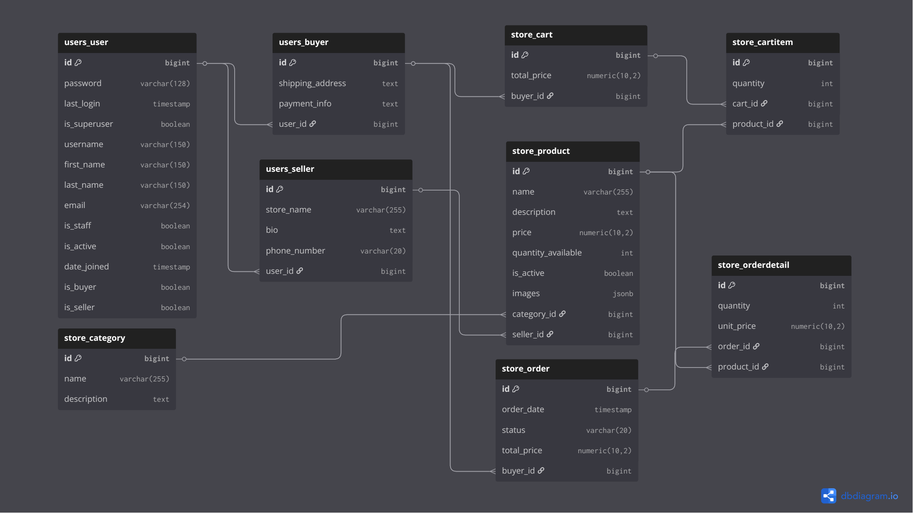

## E-Commerce Backend API

This is a **Django REST Framework** backend for an e-commerce application, supporting product catalog, categories, user registration, JWT authentication, cart management, and orders. It also includes **Swagger and ReDoc documentation** for easy API exploration thus simulating a real-world scenario for backend engineers.

---

### Features

- User registration and JWT authentication
- CRUD operations for Products and Categories management
- Basic Cart and Order API endpoints
- Filtering, sorting, Pagination, and ordering for products
- API documentation with Swagger and ReDoc
- PostgreSQL database support

---

### Tech Stack

- Python 3.8+
- Django 4.x
- Django REST Framework
- Django REST Framework Simple JWT
- drf-yasg (Swagger & ReDoc)
- PostgreSQL

---

### ERD




---

### Installation

1. **Clone the repository**

```bash
git clone <your-repo-url>
cd e_commerce_backend
```
2. **Create a virtual environment**
```bash
python -m venv .venv
source .venv/bin/activate  # Linux/macOS
.venv\Scripts\activate     # Windows
```

3.  **Install dependencies**
```bash
pip install -r requirements.txt
```

4.  **Configure your database**
```python
DATABASES = {
    'default': {
        'ENGINE': 'django.db.backends.postgresql',
        'NAME': 'ecommerce_db',
        'USER': 'postgres',
        'PASSWORD': 'your_password',
        'HOST': 'localhost',
        'PORT': '5432',
    }
}
```

5. **Run migrations**
```bash
python manage.py makemigrations
python manage.py migrate
```
 6.  **(optional) Create a superuser**
 ```bash
  python manage.py runserver
```
### Running Server
 ```bash
 python manage.py runserver
 ```
 ***URLs***
API base URL: http://127.0.0.1:8000/api/
Swagger docs: http://127.0.0.1:8000/api/docs/
ReDoc docs: http://127.0.0.1:8000/api/redoc/

### Authentication
This app uses JWT authentication:

1. **Obtain a token**
```bash
POST /api/token/
{
  "username": "your_username",
  "password": "your_password"
}
```

2. **Use the token for the requests**
Authorization: Bearer <your_access_token>

3. **Refresh token**
```bash
POST /api/token/refresh/
{
  "refresh": "<your_refresh_token>"
}
```
### API Endpoints
| Endpoint              | Method | Description                        |
| --------------------- | ------ | ---------------------------------- |
| `/api/auth/register/` | POST   | Register a new user                |
| `/api/token/`         | POST   | Obtain JWT access & refresh tokens |
| `/api/token/refresh/` | POST   | Refresh access token               |

### Products & Categories
| Endpoint                | Method           | Description                            |
| ----------------------- | ---------------- | -------------------------------------- |
| `/api/products/`        | GET, POST        | List all products / Create product     |
| `/api/products/{id}/`   | GET, PUT, DELETE | Retrieve, update, or delete a product  |
| `/api/categories/`      | GET, POST        | List all categories / Create category  |
| `/api/categories/{id}/` | GET, PUT, DELETE | Retrieve, update, or delete a category |

### Cart & Orders
| Endpoint       | Method    | Description               |
| -------------- | --------- | ------------------------- |
| `/api/cart/`   | GET, POST | View or add items to cart |
| `/api/orders/` | GET, POST | View or place orders      |


### Product Filtering & Searching
- Search by name, description, or category name:
   GET /api/products/?search=bulb

- Order by price or name:
   GET /api/products/?ordering=price or ?ordering=-price